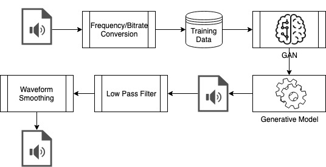

# w210-capstone-astrodrum

## Concept

Incorporate a backend machine learning concept using GANs to generate a potentially unlimited supply of drum sounds which will can be utilized in a user friendly interface for music generation and beat mixing.

### Process

The overall process flow:
* Obtain input training audio data (kick drum, snare drum, etc..) sounds.
* Manually (batch) process audio data for consistent bitrate and frequency (16bit, 44.1MHz)
* Import training data to training cluster (acquired AWS GPU's)
* Train generative models using WaveGAN
* Use generative model to generate new audio files
* Apply low pass filter to clean up audio signal
* Apply moving average filter to clean up audio signal
* Use the generated sound in application

### Approach with WaveGAN

In our approach to supply drum beats to our application, we wanted to experiment with a unique or innovative approach and thus came about our research on GANs and WaveGAN in particular.  GANs are fairly new to the realm of machine learning and comes with a unique set of technical challenges in training but allows us the flexibility of allowing us to build generative models without the use of labeled data, something we considered a benefit in working with audio data.

We started with the WaveGAN research effort as part of the foundation of our approach.

#### About WaveGAN

#### GAN Training

Our approach to training was to work and tune with WaveGAN with a focus on genering audio for Kick Drum sounds, we would then use any lessons learned and apply them to training additional sounds (Snare Drum, Hi-Hats) to improve our application.

We used AWS to provision a GPU enabled VM to process our training, we began with Kick Drum sounds (770 samples).  Training aspects with experimented with to test results:
* Training duration
* Batch sizes
* Data normalization (normalizing audio amplitude)
* Data dimension (data encoding bit size)
* Audio frequency variability

Our best training results found the following attributes to be useful:
* Batches of 64 samples
* Data normalization
* Dimensionality at 32 bits
* Using consistent audio rate: 16-bit audio, 44100Hz

The preceding findings were helpful in simplifying and ultimately accelerating training times through our dataset which ultimately resulted in better sounding audio.

Audio results were previewed and tested manually, ie what was appealing to the human ear.  However, to guide this, we still conducted some analysis of our loss function results using TensorBoard.

Additional insights and details to our implementation can be found on our project website details page.
http://www.astrobeats.com.s3-website-us-east-1.amazonaws.com/details.html

### Repo Structure

#### Basics
Introduction/Prototype code to capture the basics of wave file processing in Python.

#### Frontend
Code for our website, which includes our user interface for beat generation.  Link to our operational website:
http://www.astrobeats.com.s3-website-us-east-1.amazonaws.com/

#### Code
Additional code artificats for generating our synthetic sound files from our trained GAN models.  Key file here is SoundGenerator.ipynb

#### WaveGAN Code
Wavegan research repository  and content (references within) which we utilized and experimented with in our GAN model learning and generation of synthetic audio files

#### Miscellaneous

